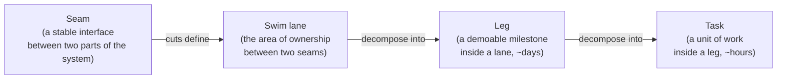
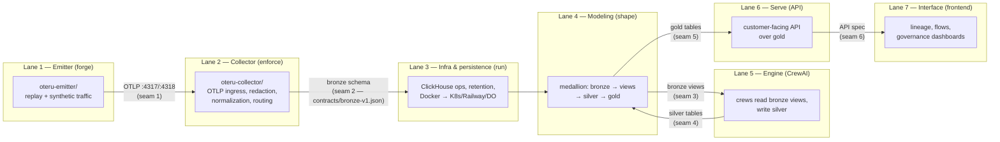
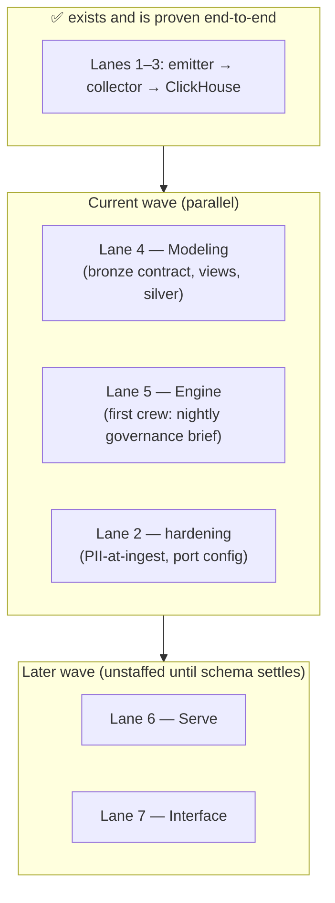
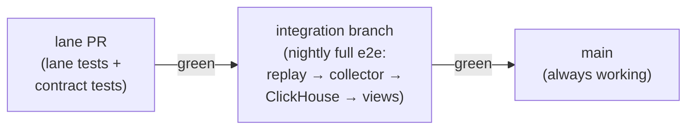

# Oteru Swim Lanes

How we parallelize Oteru across the team without breaking each other's work.
This document is the orchestrator's map: it defines the **seams**, the **swim
lanes** they create, the **contracts** that keep lanes decoupled, and the
**merge protocol** that keeps `main` always working.

---

## 1. The model: seam → swim lane → leg → task

- **Seam** — a stable interface where two parts of the system meet (OTLP on
  the wire, a ClickHouse schema, an API spec). Seams are chosen precisely
  because they change slowly.
- **Swim lane** — the owned area between two seams. One lane, one clear
  owner, one scoped set of files. Lanes never reach across seams; they talk
  to each other *only* through the contract published at the seam.
- **Leg** — a milestone inside a lane that is demoable on its own. "Build
  the silver layer" is a bad leg; "session-cost rollup written to silver,
  queryable through one view" is a good leg. Legs are what we plan week by
  week.
- **Task** — the day-sized breakdown of a leg, owned by one person.

The rule that makes all of it work: **a lane consumes the lane below it only
through the published contract at the seam — never through the other lane's
code, branch, or goodwill.**

---

## 2. The seven lanes

| # | Lane | Mission | Owns | Status |
|---|------|---------|------|--------|
| 1 | **Emitter** (forge) | Replay/generate traffic faithful to a real agent session. Today: Claude Code. Later: pluggable profiles (Codex, Kimi, CrewAI itself). | `oteru-emitter/` | Working (Phase 1) |
| 2 | **Collector** (enforce) | Receive OTLP, redact/omit/normalize, route. The governance checkpoint — everything downstream trusts data because this lane cleaned it. | `oteru-collector/` | Working; processors + port configurability open |
| 3 | **Infra & persistence** (run) | Where data lives: ClickHouse ops, retention, backups, deploy topology (Compose → K8s / Railway / DigitalOcean), secrets. Owns *where*, never *what shape*. | compose files, deploy manifests | Local sandbox working |
| 4 | **Modeling** (shape) | The medallion: **bronze** (raw `otel_*` tables, immutable) → **views over bronze** (curated, read-only projections — the engine's only door into the data) → **silver** (normalized, agent-written, write-once-read-many) → **gold** (customer-facing aggregates). Publishes the versioned schema everyone builds against. | `contracts/`, `modeling/` (future) | **Next up** |
| 5 | **Engine** (CrewAI) | Reads **only** bronze views, does analysis (cost anomalies, tool-policy violations, governance briefs), writes results to silver per lane 4's contract. | `oteru-engine/` (future) | **Next up** |
| 6 | **Serve** (API) | Customer-facing query layer over gold: endpoints, auth, rate limits. Never reaches into silver/bronze. | `oteru-serve/` (future) | Later wave |
| 7 | **Interface** (frontend) | Lineage graphs, flow visualization, governance dashboards. Consumes lane 6's API exclusively; can start against stubs once the API spec exists. | `oteru-ui/` (future) | Later wave |

Why modeling is its own lane and not part of infra: it changes for different
reasons (schema evolution vs. deploy topology), needs different skills, and
publishes the contract that lanes 2, 5, and 6 all build against. Folding it
into infra is how it becomes an afterthought.

### Sequencing

Lanes 6–7 stay unstaffed for now: against a moving schema they would churn,
not progress. Lane 7 can start the moment lane 6's API spec is written — it
builds against the spec with stubs, in parallel with lane 6's implementation.

---

## 3. Contracts: the guarantee mechanism

A contract is a **machine-checkable artifact in the repo**, not a wiki page.
Each seam has one, and CI enforces it on every PR.

| Seam | Contract artifact | Producer test (producer's PR) | Consumer test (consumer's PR) |
|------|-------------------|-------------------------------|-------------------------------|
| 1: emitter → collector | `oteru-emitter/samples/telemetry-sample.json` (golden fixture) | `make dry-run` validates the fixture | collector e2e replays the fixture |
| 2: collector → bronze | `contracts/bronze-v1.json` | `scripts/check_bronze_contract.py` replays the fixture through the real pipeline and diffs reality vs. contract | lane 4 tests run against a **frozen fixture**, never against lane 2's branch |
| 3: bronze → engine | view definitions (`modeling/views/`, future) | views created + canary queries against the fixture | engine runs against fixture-backed views |
| 5: gold → serve | API spec (future) | spec lint + schema diff | interface builds against the spec with stubs |

### The compatibility rule

- **Additive changes are free.** New attribute, new column, new table → no
  approval needed, merge it.
- **Breaking changes follow the protocol.** Rename or remove anything a
  contract covers → the producer's PR goes red in CI, the contract file must
  change in the same PR (which requires the consuming lane's review), and the
  change ships as **both old and new for a migration window** while consumers
  move to the new version. Old version is removed only in the next contract
  version (`bronze-v2`). Never mutate a contract in place.

This one rule eliminates the classic failure: lane 2 renames `cost_usd`,
lane 4's views silently return garbage, nobody notices for a week. With the
contract, lane 2's own PR fails in minutes, naming the exact attribute — and
lane 4's work is never blocked, because lane 4 is pinned to the frozen
contract artifact, not to lane 2's branch.

### Worked example (lane 2 breaks the bronze contract)

1. Lane-2 dev opens a PR renaming `cost_usd` → `cost.usd_micros` in the
   collector pipeline.
2. The **Contract** CI workflow replays the golden fixture through the real
   collector + ClickHouse and runs `check_bronze_contract.py` → diff shows
   `cost_usd` missing → **red on his PR**, minutes later.
3. Two doors: (a) unintentional → fix, push, green, merge — lane 4 never
   knew; (b) intentional → update `contracts/bronze-v1.json` in the same PR,
   lane 4 reviews, agreed form ships both attributes for a migration window.
4. Meanwhile lane 4's PRs stay green the whole time — their tests run
   against the frozen v1 fixture.
5. Only contract-green work merges toward `main`.

---

## 4. Merge protocol

- Lane PRs run lane-local tests **plus** the contract tests of the seams they
  touch. Fast, per-PR.
- The full end-to-end run (the manual flow we verified by hand) runs on the
  integration branch, not per-PR, so PRs stay fast.
- `main` only ever receives merges from a green integration branch.
- Contract files (`contracts/**`) require the consuming lane owner's review —
  one line of approval, but no contract changes without the consumer knowing
  (wire this via `.github/CODEOWNERS` once team handles are confirmed).

---

## 5. Operating rhythm (7 people)

- **Staffing follows the wave, not one-person-per-lane.** Today: lanes 4 and
  5 staffed heavily, lane 2 ticking (hardening), lane 3 part-time, lanes 6–7
  unstaffed.
- **Planning unit is the leg.** Each lane's current leg has a done-criterion
  that is demoable. Tasks are the daily breakdown nobody outside the lane
  needs to see.
- **Weekly demo per lane against its leg's done-criterion.** If a leg can't
  be demoed, it was cut wrong — re-cut it, don't extend it silently.
- **When you need a change from another lane, you ask for a contract change,
  not a favor.** The contract diff *is* the request, and CI is the referee —
  not people remembering to be careful.

---

## 6. Current contracts in this repo

- [`contracts/bronze-v1.json`](../contracts/bronze-v1.json) — the bronze
  schema guaranteed by the collector→ClickHouse pipeline (tables, columns,
  attribute keys, metric names). Verified by
  `scripts/check_bronze_contract.py` in the **Contract** CI workflow and via
  `make contract-check`.
